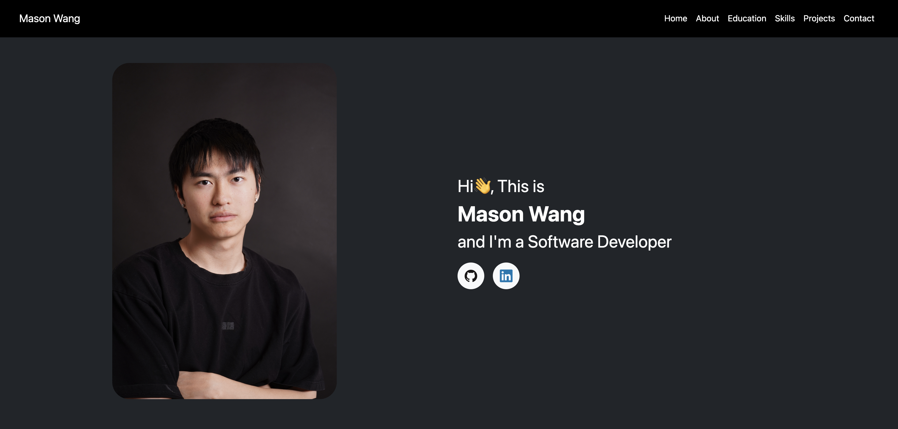
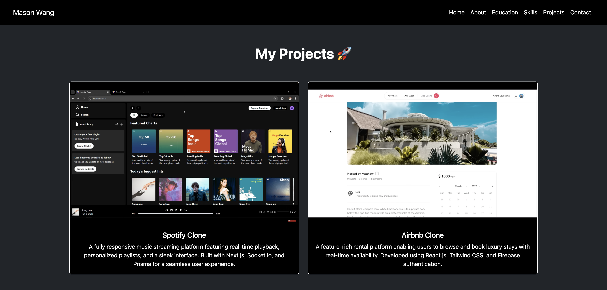

# Mason Wang Personal Homepage

## Author
**Name**: Yachen Wang (Mason)  
**Class**: CS5610 - Web Development  
**Class Link**: https://johnguerra.co/classes/webDevelopment_spring_2025/  
**Design Doc**: https://docs.google.com/document/d/1xVp95w63Dpnob-XolxhmsHt6VNIu7tCLXmQuUiRLhm4/edit?usp=sharing  
**Slides**: https://docs.google.com/presentation/d/1df0r7nBfB9w_Ayc51t0taykHQCFrZFMM5fm4epdwnNY/edit?usp=sharing  

## Project Objective
This project is a personal homepage designed to showcase my professional background, technical skills, and past projects. Built with responsiveness and user experience in mind, it serves as an engaging portfolio for students, professionals, and potential collaborators. The website includes:
- A clean layout to navigate my accomplishments and contact details  
- A section for projects  
- An interactive **"Back to Top"** button

## Screenshots
### Homepage  
  

### Projects Page  
  

## Instructions to Build
### Clone the repository:
git clone https://github.com/masonwangmason/personal-website.git  
### Navigate to project directory:
cd personal-website  
### Install http-server globally (if you haven't)
npm install -g http-server  
### Run http-server
http-server
### Visit the following in your desired browser
http://localhost:8080  

## License
This project is licensed under the MIT License. See the LICENSE file for details.
